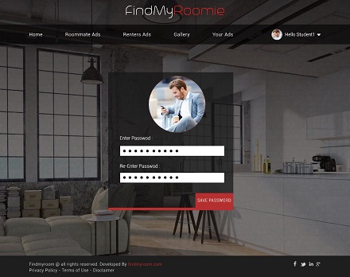

# FindMyRoomie

1.1) INTRODUCTION 
The objective of the project is to build a website for ITU students to find accommodation post advertisements and a platform for communication. The website user interface will be designed effectively to understand and utilize the functionalities with ease.

2.1) REQUIREMENTS 

2.1.1 Functional Requirements 
Website to provide a platform for ITU students to find accommodation by interacting with ITU students and leasing companies based on various price ranges and amenities.
* Registration Page 
ITU student and Renter (leasing companies/landlords) can signup using their username, emailid and password. ITU students profile are verified by sending user activation link to the irrespective ITU email account. User can register by clicking “Sign up” link.
Login Page
	Sign into website as Student or Renter 
•	Student Login : Student account will be identified by using his email id. Student can reset his password using “Forgot Password” link. Student has access to find accommodation and able to view all advertisements (ads) posted by other ITU students and renters.
•	Student Home Page: Student home page consists of search functionality using price range, accommodation type, beds, available date from, shared rooms, property to rent and extra filters such as pet friendly, laundry, swimming pool, smoking friendly, parking and  gym/fitness center.
•	Roommate Ads tab: List all the ads posted by ITU students. The details include rent, address, brief description and pictures. Full details can be viewed by clicking on the ad.
•	Renter Ads tab: List all the ads posted by renters such as leasing companies and landlords. The details include rent, address, brief description and pictures. Full details can be viewed by clicking on the ad. 
•	My Ads tab: List all the ads posted by ITU student to share a room or rent a property. This tab shows details such as rent, pictures and brief description. The student can edit or delete the ad posted.
	Post an Advertisement tab: Student can post an advertisement and have to provide details such as title, description, address, zip code, rent, type, beds and availability date etc.
	Upload Picture tab: After entering details and clicking create, the user will be able to upload the pictures.
•	Messages tab: This is a messaging platform for ITU student to communicate to renters. 
•	Manage Profile: ITU student can manage his profile and able to update his address, contact information, upload his/her picture and reset password.
	Renter Login: Renter can login by using his credentials and has access to post ads, view ads from other renters and communicate to the requests from ITU students
•	Ad Space: Ad Space is a home page for renters and it lists all ads posted by renters. Ads show the details such as rent, address and pictures. Full details of the ad can be viewed by clicking on the ad. 
•	My Ads: List all the ads posted by the respective renter. Renter can edit or delete the ads posted.
	Post an Advertisement: Renter can post an advertisement and have to provide details such as title, description, address, zip code, rent, type, beds and availability date etc. 
	Upload Picture tab: After entering details and clicking create, the user will be able to upload the pictures
•	Messages tab: This is a messaging platform for Renter to communicate to ITU students. 
•	Manage Profile: Renter can manage his profile and able to update his address, contact information, upload his/her picture and reset password.

2.1.2. Non Functional Requirements
● Ease of Use - User friendly and effective user interface
● Platform - Accessible on any device and browser
● Website loading - Effective code for faster response time
● Security - Allows only ITU Students to find accommodation
● Database - Designing according to the functionality and limitations
● Scalability - New functionalities could be added by modularity approach.
● Cost - Open source tools are used effective budget
● Performance - website loading and search results

